# Container Orchestration with Kubernetes

This section focuses on deploying and managing containerized applications using **Kubernetes**, the industry standard container orchestration platform.

The projects in this section demonstrate how Kubernetes automates container deployment, scaling, networking, and configuration management in production environments.

These implementations build on previous sections involving Docker, CI/CD pipelines, and cloud infrastructure.

---

## 🎯 Purpose of This Section

The objective of these projects is to demonstrate:

- Deploying containerized applications in Kubernetes clusters
- Managing application configuration using ConfigMaps and Secrets
- Deploying stateful services in Kubernetes
- Using Helm for Kubernetes package management
- Managing microservices deployments
- Deploying applications from private container registries

---

## 🧱 Architecture Overview

- **Container Runtime:** Docker
- **Container Orchestration:** Kubernetes
- **Cluster Platforms:** Minikube / Managed Kubernetes
- **Package Management:** Helm
- **Container Registry:** AWS ECR / Docker Hub
- **Applications:** MongoDB, Mongo Express, Microservices applications

---

## 🛠 Technologies Used

- Kubernetes
- Docker
- Helm
- Minikube
- AWS ECR
- Linux
- Microservices architecture

---

## 📁 Projects Included

### 1️⃣ Deploy MongoDB and Mongo Express in a Local Kubernetes Cluster

- Set up a local Kubernetes cluster using **Minikube**

  

  

- Created Kubernetes manifests for:
  - Deployments
    

- Configured MongoDB credentials using **Secrets**

  

  

- Managed application configuration using **ConfigMaps**

  

  

  

  

  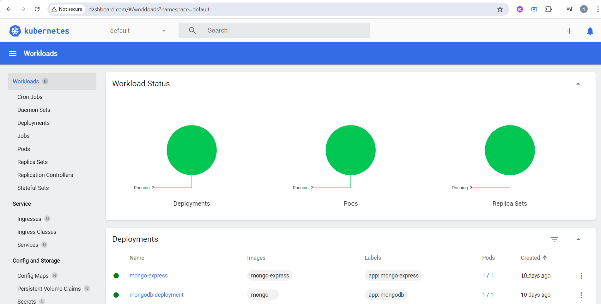

  
---

### 2️⃣ Deploy Stateful Services Using Helm

- Created a managed Kubernetes cluster

  

  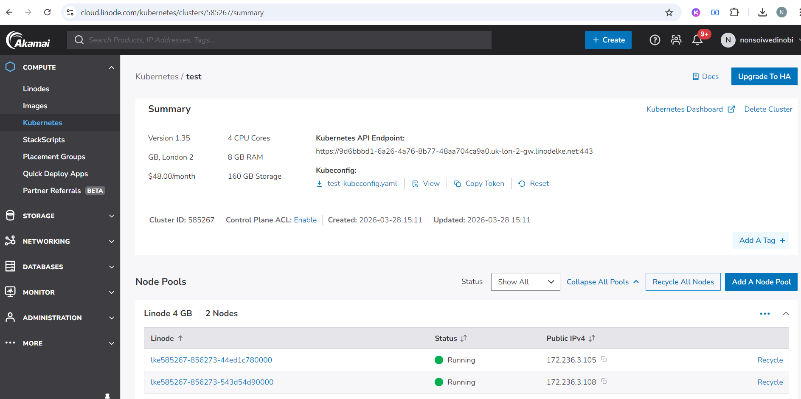

- Installed MongoDB using a **Helm chart**

  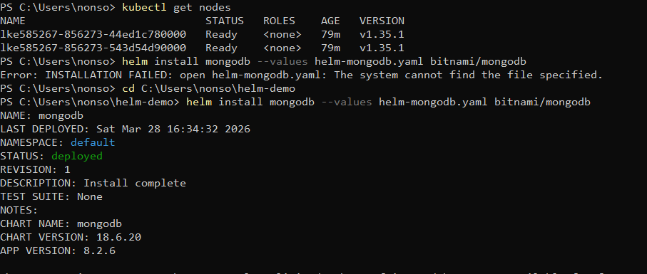

- Configured persistent storage

  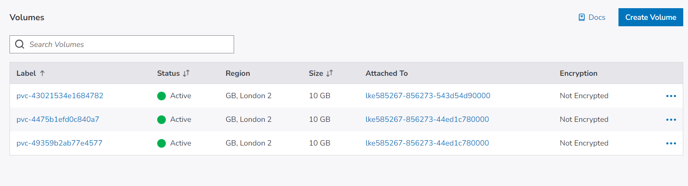

- Configured **NGINX ingress** for external access

  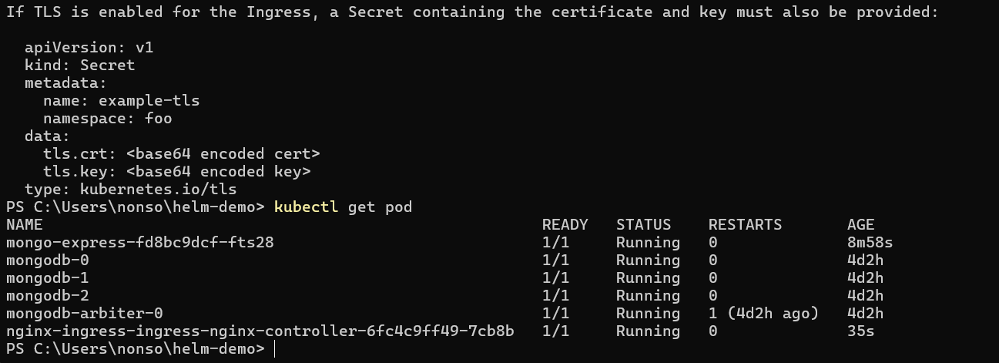

- Deployed Mongo Express as a client UI

  

  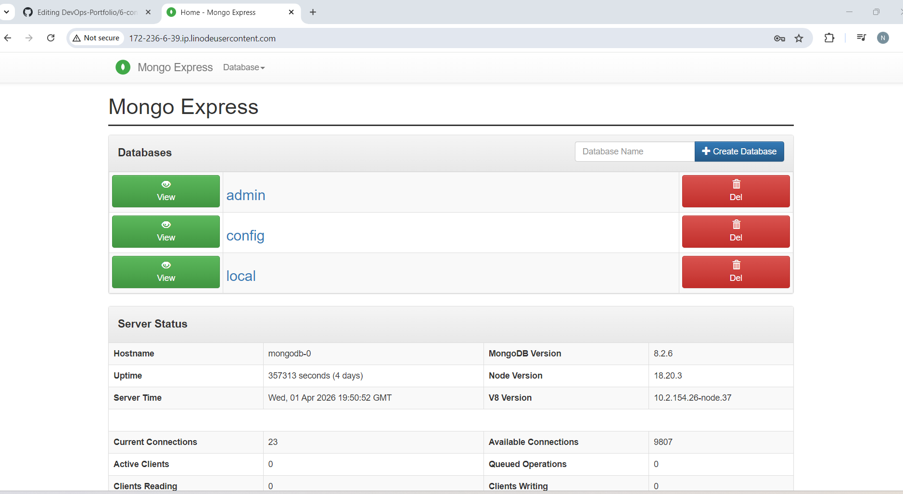

---

### 3️⃣ Deploy Mosquitto Message Broker Using ConfigMaps and Secrets

- Created Kubernetes configuration for Mosquitto

  

  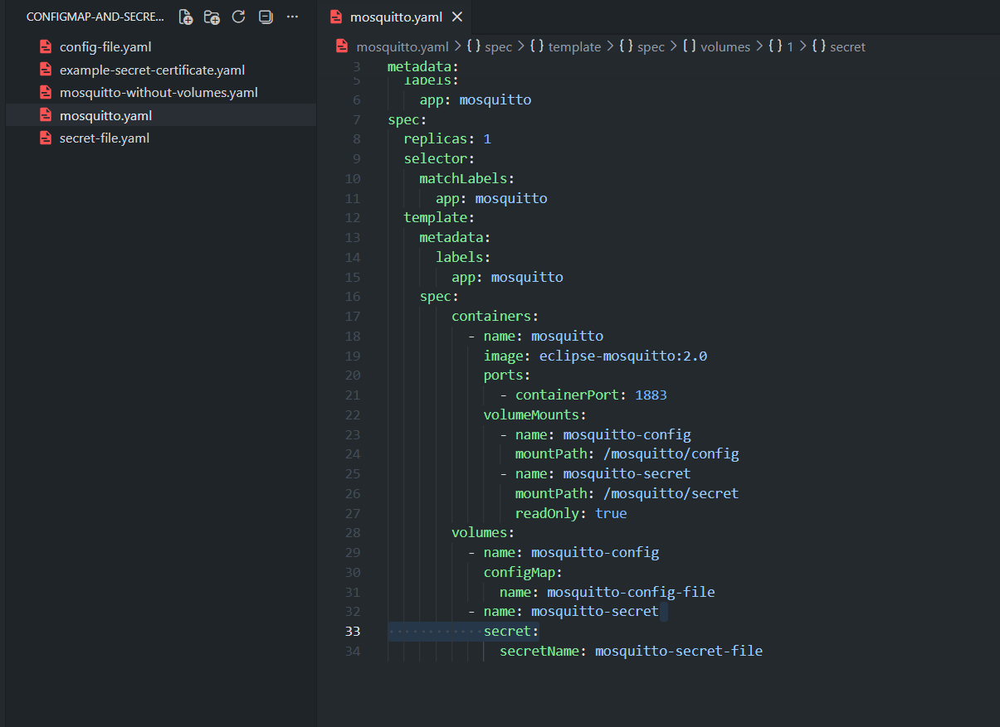

  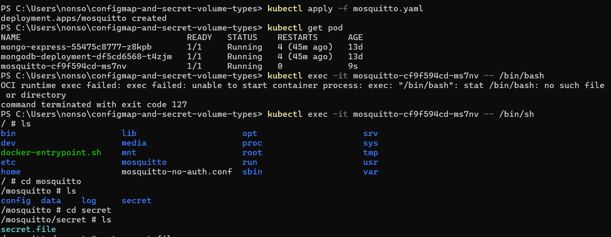

---

### 4️⃣ Deploy Application from Private Docker Registry

- Created Kubernetes **image pull secrets**

  

  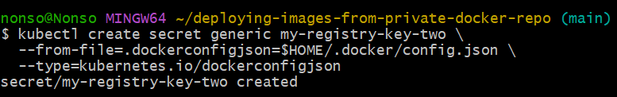
  

- Configured Kubernetes deployment to pull images from private registry

  

  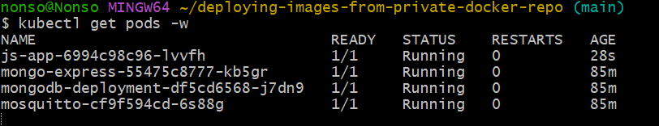
  

- Deployed application to cluster
---

### 5️⃣ Deploy Microservices Application to Kubernetes

- Created Kubernetes manifests for microservices architecture

  

  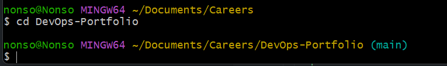
  

- Deployed application components into cluster

  

  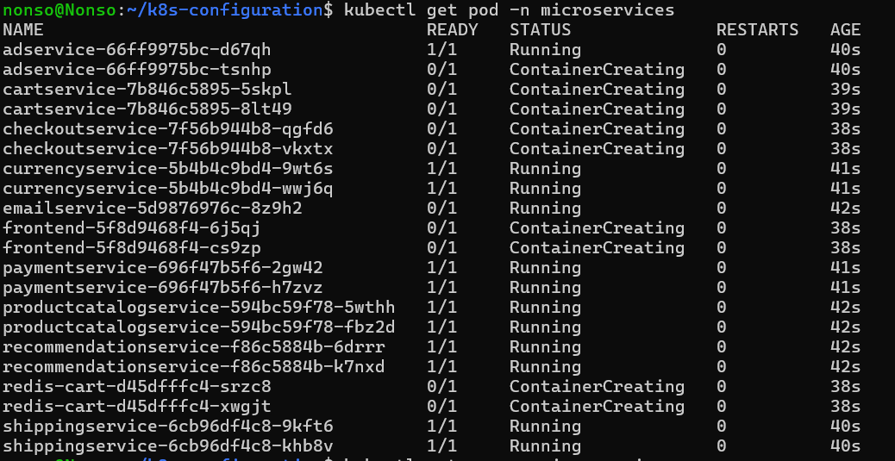
  

- Verified service communication between containers

  

  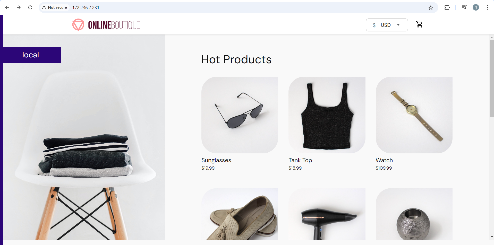
  

---

### 6️⃣ Create Reusable Helm Charts

- Created reusable Helm chart templates
- Defined Deployment and Service templates
- Parameterized application configuration
- Reused charts across multiple services

📸 *Screenshot: Helm chart deployment*

---

### 7️⃣ Deploy Applications Using Helmfile

- Managed multiple Helm deployments using **Helmfile**
- Simplified management of microservices deployments
- Centralized environment configuration

📸 *Screenshot: Helmfile deployment*

---

## 🔐 Security Considerations

- Stored sensitive credentials using Kubernetes Secrets
- Restricted access to private container registries
- Configured proper role-based access control (RBAC)
- Followed least-privilege access principles

---

## 🧠 Key DevOps Concepts Demonstrated

- Container orchestration
- Infrastructure abstraction
- Declarative infrastructure management
- Stateful vs stateless workloads
- Kubernetes configuration management
- Microservices deployment patterns
- Kubernetes package management with Helm

---

## 📚 Lessons Learned

- Managing complex applications using Kubernetes
- Importance of configuration management
- Benefits of declarative infrastructure
- Helm's role in simplifying Kubernetes deployments
- Challenges of networking and service discovery

---

## 🔜 Future Improvements

- Implement Horizontal Pod Autoscaling
- Add Kubernetes health checks and probes
- Integrate Kubernetes deployments into CI/CD pipelines
- Implement GitOps workflows
- Introduce service mesh technologies

---

## 👤 Author

**Nonso Iwedinobi**  
DevOps Engineer
