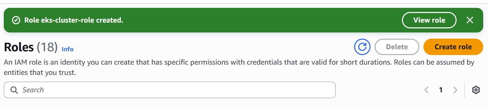
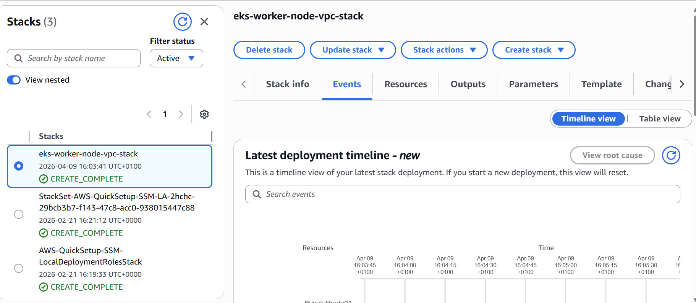
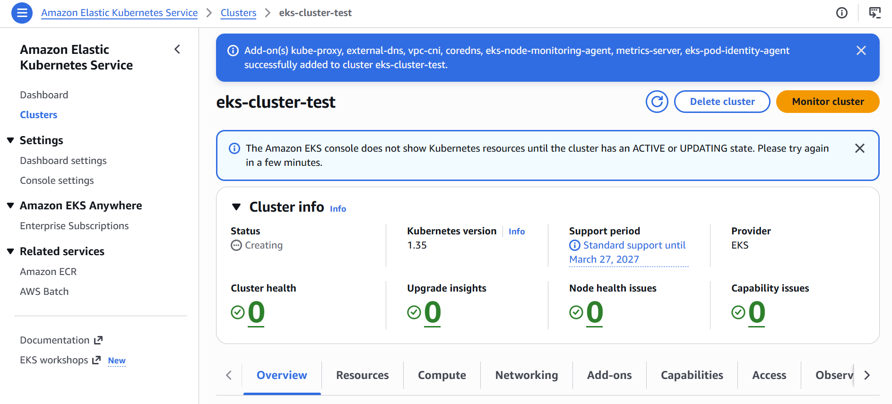
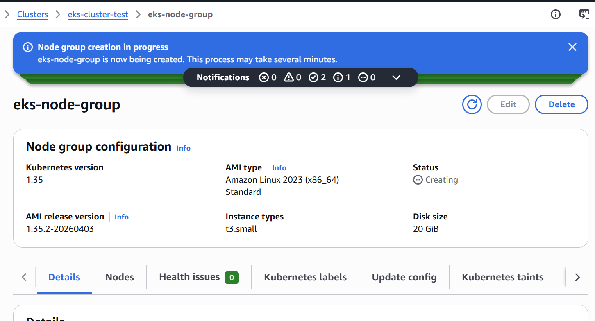
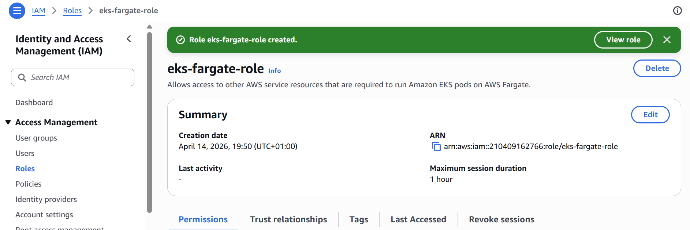
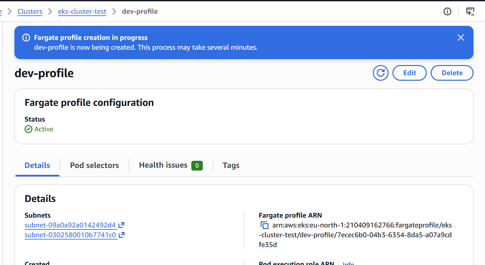
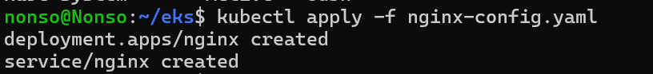
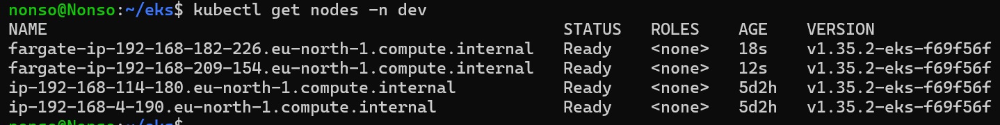
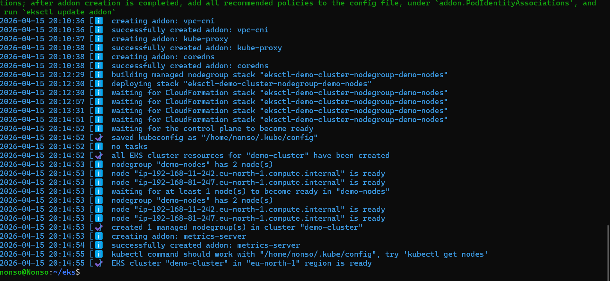

# Kubernetes on AWS EKS – Managed Kubernetes & CI/CD Integration

This section focuses on deploying and managing Kubernetes clusters using **Amazon Elastic Kubernetes Service (EKS)**.

The projects demonstrate how to provision EKS clusters, deploy applications, and integrate Kubernetes deployments into CI/CD pipelines using Jenkins.

This represents a production-grade setup where containerized applications are deployed and managed in a scalable, cloud-native environment.

---

## 🎯 Purpose of This Section

The objective of these projects is to demonstrate:

- Provisioning Kubernetes clusters using AWS EKS
- Understanding EKS architecture (control plane vs worker nodes)
- Deploying applications to managed Kubernetes clusters
- Integrating CI/CD pipelines with Kubernetes deployments
- Using private container registries (Docker Hub & AWS ECR)
- Automating application delivery to Kubernetes

---

## 🧱 Architecture Overview

- **Cloud Provider:** AWS
- **Kubernetes Platform:** Amazon EKS
- **Cluster Provisioning:** eksctl / AWS CLI
- **Compute Options:**
  - EC2 Node Groups
  - AWS Fargate
- **CI/CD Tool:** Jenkins
- **Container Registry:** Docker Hub / AWS ECR
- **Access Tools:** kubectl, AWS IAM

---

## 🛠 Technologies Used

- AWS EKS
- AWS IAM
- eksctl
- Kubernetes
- Docker
- Jenkins
- AWS ECR
- Linux
- Git
- Java (Maven)

---

## 📁 Projects Included

### 1️⃣ Create EKS Cluster with Node Group

- Configured IAM roles for EKS

  

  

- Created VPC and networking components

  

- Provisioned EKS cluster (control plane)

  

- Created and attached worker node group

  

- Enabled auto-scaling for worker nodes
- Deployed a sample application

---

### 2️⃣ Create EKS Cluster with Fargate

- Configured Fargate IAM roles

  

  

- Created Fargate profile

  

- Deployed application using serverless compute

  

- Verified pods running without managing EC2 nodes

  

### 3️⃣ Create EKS Cluster Using eksctl

- Used `eksctl` to simplify cluster provisioning

  

  

---

## 🔐 Security Considerations

- IAM roles configured for cluster and nodes
- Secure access to EKS using kubeconfig and IAM authentication
- Private container registry usage (ECR)
- Credentials securely stored in Jenkins
- Restricted access using security groups and IAM policies

---

## 🧠 Key DevOps Concepts Demonstrated

- Managed Kubernetes (EKS)
- Infrastructure abstraction and scalability
- CI/CD integration with Kubernetes
- Container registry integration (ECR, Docker Hub)
- Automated application deployment pipelines
- Cloud-native application delivery

---

## 📚 Lessons Learned

- Differences between self-managed Kubernetes and EKS
- Trade-offs between EC2 nodes and Fargate
- Importance of IAM roles in Kubernetes access control
- Challenges of integrating CI/CD with Kubernetes
- Managing authentication between Jenkins, AWS, and Kubernetes

---

## 🔜 Future Improvements

- Implement GitOps workflows (ArgoCD / Flux)
- Add monitoring (Prometheus & Grafana)
- Implement auto-scaling (HPA & Cluster Autoscaler)
- Use Terraform for EKS provisioning
- Introduce multi-environment deployments (dev/staging/prod)

---

## 👤 Author

**Nonso Iwedinobi**  
DevOps Engineer
